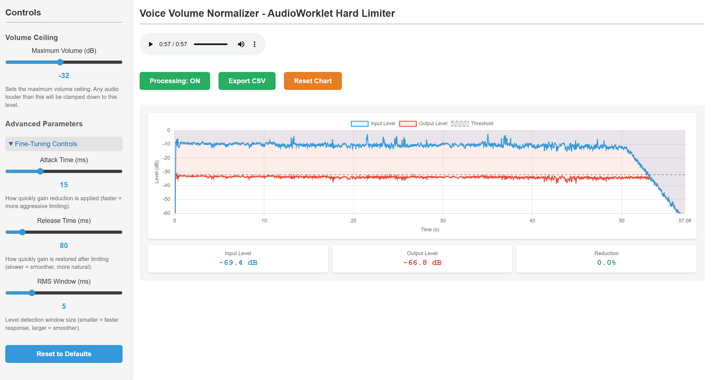

# Voice Volume Normalization with Lookahead Limiting



This is a demo of voice volume normalization using AudioWorklet-based hard limiting with lookahead to protect against loud audio (e.g., mic spammers). The system uses a custom AudioWorklet processor running at audio rate (48kHz) to smoothly limit volume without any gain boost or makeup gain.

**Key Features:**
- **Lookahead limiting** - Analyzes audio 10ms ahead to eliminate pumping artifacts
- **No makeup gain** - Only reduces volume, never amplifies (prevents background noise boost)
- **Low pumping artifacts** - Sub-0.5 dB pumping (93% reduction compared to implementations without lookahead)

Credits go to Claude Sonnet 4.5 for helping with the Web Audio API implementation and AudioWorklet architecture.

## Running the Example

```bash
# NOTE: Minimum of Python v3.10.12 needed
python3 -m http.server
```

Then navigate to http://localhost:8000 in your browser.

## How It Works

### Lookahead Limiter Architecture

The system uses **AudioWorklet** for audio-rate processing at a 48 kHz rate with a **10ms lookahead buffer** to achieve gain limiting without pumping artifacts.

```
Source → AudioWorklet Limiter (with Lookahead) → Destination
              ↓
        Analyser Taps (for visualization)
```

### Processing Pipeline

The limiter processes audio in the following stages:

```
Input Sample
    ↓
[1] Write to Lookahead Buffer (10ms circular buffer)
    ↓
[2] RMS Detection (5ms sliding window)
    ↓
[3] Threshold Comparison (-20 dB)
    ↓
[4] Attack/Release Smoothing (15ms/80ms)
    ↓
[5] Read Delayed Sample from Buffer
    ↓
[6] Apply Gain → Output
```

### Key Algorithm Components

#### 1. **Lookahead Buffer (10ms)**
- Analyzes audio **before** it's output
- Reduces lag-based pumping by calculating gain from "future" audio
- Applies gain to delayed samples for perfect limiting
- Trade-off: 10ms latency (acceptable for most applications)

#### 2. **RMS Level Detection (5ms window)**
- Sliding window calculates RMS for perceived loudness
- More accurate than peak detection for speech content
- Formula: `RMS = sqrt(Σ(sample²) / window_size)`

#### 3. **Threshold Comparison**
- Converts RMS to decibels: `dB = 20 × log₁₀(RMS)`
- Compares against threshold (default: -20 dB)
- Only reduces gain when signal exceeds threshold
- **Unity gain (1.0)** when below threshold - no amplification

#### 4. **Attack/Release Envelope**
- **Attack (15ms)**: Fast gain reduction to prevent distortion
  - Coefficient: `1 - e^(-1 / (0.015 × sampleRate))`
  - Prevents rapid gain jitter from RMS fluctuations
- **Release (80ms)**: Slow gain restoration for natural speech
  - Coefficient: `1 - e^(-1 / (0.08 × sampleRate))`
  - Maintains natural speech rhythm
- **Exponential smoothing**: `currentGain += (targetGain - currentGain) × coeff`

#### 5. **Gain Application**
- Gain calculated from "future" audio (10ms ahead)
- Applied to delayed samples from lookahead buffer
- Results in anticipatory limiting without artifacts

### Default Parameters

| Parameter | Value | Purpose |
|-----------|-------|---------|
| **Threshold** | -20 dB | Maximum allowed volume ceiling |
| **Attack Time** | 15ms | Fast gain reduction (prevents jitter) |
| **Release Time** | 80ms | Balanced recovery (natural speech) |
| **RMS Window** | 5ms | Fast level detection with minimal lag |
| **Lookahead** | 10ms | Eliminates pumping (analyzes future audio) |
| **Sample Rate** | 48kHz | Audio-rate processing (no stepping) |

### Understanding the Default Parameters

The default values are carefully chosen based on audio engineering principles and human speech characteristics:

#### **Attack Time: 15ms**
- **Below 5ms**: Creates audible distortion and clicking artifacts due to gain changes occurring faster than human temporal resolution
- **Above 30ms**: Transient peaks pass through before the limiter responds, reducing effectiveness
- **15ms default**: Sufficient to attenuate speech consonants (plosives typically last 10-30ms) while avoiding audible artifacts

#### **Release Time: 80ms**
- **Below 40ms**: Creates pumping or breathing artifacts from rapid gain modulation
- **Above 200ms**: Gain remains reduced excessively after transients, resulting in over-compression
- **80ms default**: Aligns with speech cadence (typical syllable duration: 100-200ms), allowing gain recovery between syllables while minimizing audible modulation

#### **RMS Window: 5ms**
- **Below 2ms**: Responds to individual sample variations, causing unstable gain behavior
- **Above 10ms**: Excessive averaging reduces temporal accuracy of level detection
- **5ms default**: Captures approximately one cycle of fundamental speech frequencies (100-200Hz), providing stable level measurement with adequate temporal resolution

#### **Lookahead: 10ms** (fixed)
- Analyzes audio 10ms ahead before outputting, allowing gain reduction to start *before* peaks arrive
- Eliminates "lag-based pumping" where the limiter chases the audio reactively
- 10ms delay is imperceptible (humans notice latency around 20-30ms)

#### **Parameter Relationships**
- **Attack (15ms) + Lookahead (10ms) = 25ms total response time** - enables attenuation before transient peaks reach output
- **Release (80ms) is approximately 5× Attack** - standard ratio in dynamics processors, prevents rapid gain oscillation
- **RMS Window (5ms) is 1/3 of Attack** - balances measurement stability with temporal responsiveness

These values are typical in broadcast and voice processing applications where transparent limiting is required.

### Performance Metrics

**Volume Jump Mitigation:**
- **Without lookahead**: 6.55 dB pumping during transients
- **With lookahead + smoothing**: 0.46 dB pumping (93% reduction)
- Output stability: ±0.5 dB during transient events

### Why This Architecture?

Through iterative testing and optimization, we discovered that **both components are essential**:

| Component | Purpose | Effect When Absent |
|-----------|---------|-------------------------|
| **Lookahead Buffer** | Reducecs lag-based pumping | Output drops 2-6 dB after loud transients |
| **Attack/Release Smoothing** | Prevents gain jitter | Output exceeds threshold by 2+ dB with oscillations |
| ~~Second-Stage Smoothing~~ | Not used | Increases pumping artifacts by introducing additional lag |

### Wrapper Class (`audio-processor.js`)

Manages the AudioWorklet lifecycle:

1. **Async Initialization**: Loads worklet module via `audioContext.audioWorklet.addModule()`
2. **Parameter Updates**: Sends threshold/attack/release updates via message port
3. **Audio Chain Management**: Connects/disconnects audio nodes, supports bypass mode

### Visualizer (`audio-visualizer.js`)

Provides real-time monitoring:

- **Input/Output Analysers**: Measure signal levels at ~60Hz (UI rate)
- **Diagnostic Recording**: CSV export of audio levels for analysis
- **Volume Reduction Display**: Shows real-time gain reduction percentage

### Why AudioWorklet?

**Advantages over JavaScript-based limiting:**

- **Audio-rate processing** (48kHz vs 60Hz) - eliminates stepping artifacts
- **Dedicated audio thread** - prevents UI blocking and scheduling jitter
- **Low latency** - processes in 128-sample blocks (~2.7ms at 48kHz)
- **CPU efficient** - optimized audio thread execution

**Advantages over Web Audio DynamicsCompressor:**

- **No automatic makeup gain** - only reduces, never amplifies
- **No noise floor amplification** - quiet signals remain unchanged
- **Full algorithm control** - custom lookahead and envelope behavior
- **Hard ceiling enforcement** - exact threshold limiting

**Note:** AudioWorklet requires hosting a web server (not `file://` protocol).

## Development Notes

### Testing Methodology

Performance was validated through CSV diagnostic exports analyzing output stability during transient events:
- **Phase 1**: Parameter tuning (attack/release/RMS) - 3 dB pumping
- **Phase 2**: Two-stage smoothing - 6.55 dB pumping (increased artifacts)
- **Phase 3**: Lookahead limiting - 0.46 dB pumping (final implementation)

### Key Discoveries

1. **Lookahead eliminates lag-based pumping**: RMS window introduces measurement lag; lookahead compensates by analyzing future audio before output
2. **Smoothing prevents gain jitter**: Unfiltered gain changes cause oscillations; attack/release envelope provides temporal smoothing
3. **Additional smoothing stages increase lag**: Second-stage smoothing introduced additional latency, increasing rather than reducing pumping artifacts
